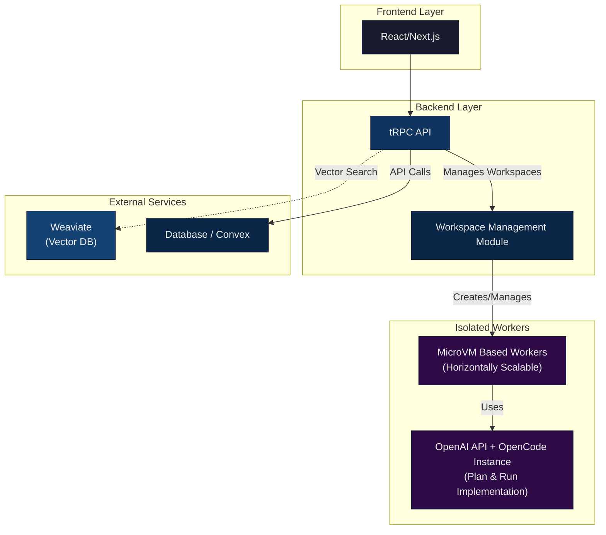
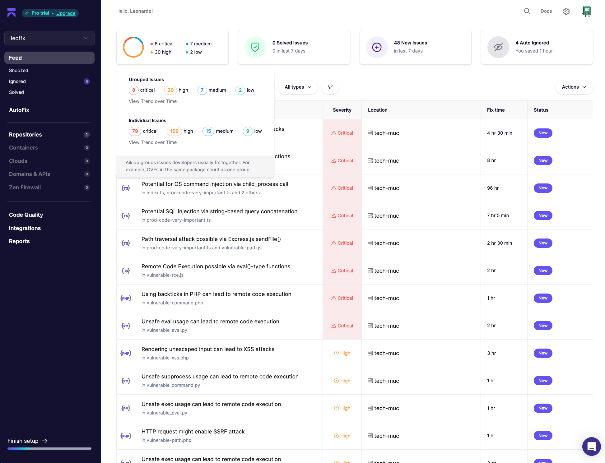

# Tech MUC

Project created for the [{Tech: Europe} Munich Hackathon](https://luma.com/munich-hack).

**AI-Powered Project Management and Ticket Automation System**

This is an intelligent project management platform that combines real-time collaboration with AI-driven development automation. Built for the modern development workflow, it enables teams to plan, track, and automatically implement features through natural language ticket descriptions.

---

## 🎯 Target Architecture



---

## 😈 Vulnerability Report

79 critical + 109 high + 15 medium + 9 low = 212 vulnerabilities!



---

## 👀 Overview

Tech MUC streamlines software development by:

- **AI Agent Automation**: Automatically implements tickets using OpenCode AI agents
- **Real-Time Collaboration**: Live updates via Convex backend
- **Preview Deployments**: Automatic static build previews for every implementation
- **GitHub Integration**: Creates pull requests automatically from completed work
- **Project Management**: Kanban-style boards with drag-and-drop ticket organization

---

## 🚀 Quick Start

### Prerequisites

- **Node.js** 20+ and npm 10+
- **Convex Account**: [Sign up at convex.dev](https://convex.dev)
- **OpenAI API Key**: [Get from platform.openai.com](https://platform.openai.com)
- **AWS S3** (optional): For preview deployments
- **GitHub Token** (optional): For automatic PR creation

### Installation

```bash
# 1. Clone the repository
git clone https://github.com/leoffx/tech-muc.git
cd tech-muc

# 2. Install dependencies
npm install

# 3. Deploy Convex backend
npx convex deploy --yes
# Follow prompts to create/select your Convex project

# 4. Configure environment variables
cp .env.example .env
# Edit .env with your credentials:
# - CONVEX_URL (from Convex dashboard)
# - OPENAI_API_KEY (for AI agent)
# - GH_TOKEN (optional, for GitHub PR creation)
# - PREVIEW_BUCKET, PREVIEW_REGION (optional, for S3 previews)
```

Visit **http://localhost:9000** (production) or **http://localhost:3000** (development).

---

## 🏗️ Architecture

### Project Structure

```
tech-muc/
├── src/
│   ├── app/                      # Next.js App Router pages
│   │   ├── _components/          # Shared UI components
│   │   ├── projects/             # Projects routes
│   │   ├── tickets/              # Tickets routes
│   │   └── api/                  # API routes
│   ├── server/                   # tRPC server
│   │   ├── api/routers/          # tRPC routers
│   │   └── agent/                # OpenCode AI integration
│   ├── lib/                      # Utilities and helpers
│   ├── trpc/                     # tRPC client setup
│   └── styles/                   # Global styles
├── convex/                       # Convex backend
│   ├── schema.ts                 # Database schema
│   ├── tickets.ts                # Ticket operations
│   ├── projects.ts               # Project operations
│   └── authors.ts                # Author operations
├── public/                       # Static assets
├── scripts/                      # Build/deployment scripts
└── docker-compose.yml            # Production container config
```

---

## 🤖 AI Agent Workflow

### 1. Planning Phase

User creates a ticket with description → AI agent analyzes requirements → Generates implementation plan (markdown) → Saves to `ticket.plan`

### 2. Implementation Phase

Agent executes plan → Writes code in linked GitHub repository → Runs tests and checks → Builds static preview

### 3. Preview Deployment

Builds project (`npm run preview:build`) → Uploads to S3 bucket → Stores URL in `ticket.previewUrl` → Creates `/latest/` mirror

### 4. PR Creation

Creates GitHub PR with changes → Links PR URL to `ticket.pullRequestUrl` → Marks ticket as done

---

## 🔒 Environment Variables

### Required

```env
CONVEX_URL=https://your-deployment.convex.cloud
OPENAI_API_KEY=sk-...
```

### Optional

```env
# GitHub Integration
GH_TOKEN=ghp_...                              # For automatic PR creation

# OpenCode Configuration
OPENCODE_MODEL=openai/gpt-5-codex             # Default AI model
OPENCODE_ENDPOINT=https://custom.endpoint     # Override OpenCode API

# Preview Deployments
PREVIEW_BUCKET=tech-munich                    # S3 bucket name
PREVIEW_REGION=eu-central-1                   # AWS region
PREVIEW_WEBSITE_BASE_URL=https://previews.example.com  # Custom domain
```
